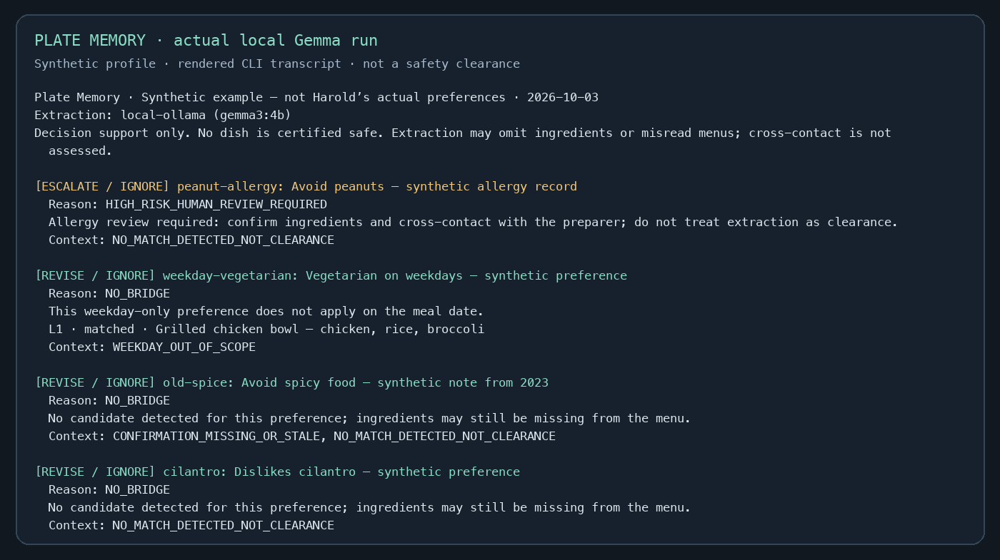
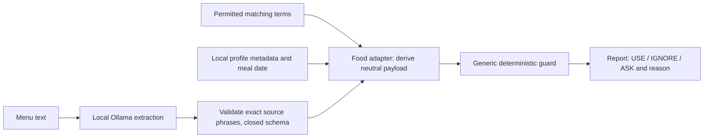

# Plate Memory

[](https://github.com/Jesse-Zeng423/plate-memory/actions/workflows/tests.yml)

**That bro who ate with you every day back in high school.**

Remember the preference. Check whether it applies today.

A guided local terminal app built for Harold, Jesse's friend and roommate from high school,
and a big foodie. Before planning a meal, it checks remembered preferences against
the meal's actual context. Harold's specific preferences and trial feedback are
still to be supplied; every profile and menu committed here is explicitly synthetic.

An open-weight model extracts food phrases from a pasted menu. A food adapter
maps these grounded phrases to remembered concepts. A domain-neutral,
deterministic Python guard then decides which memories can be
used, ignored, or need confirmation. A relevant memory can be stale or out of scope.

For example, a **synthetic** weekday-only vegetarian preference applies on Friday,
but does not apply on Saturday. A 2023 note about spicy food needs confirmation.
An allergy record always needs human review even when no ingredient is detected;
revoked permission takes priority and withholds the record.

## A seat saved for a friend

The app now starts with two choices: **too tired → takeout**, or **up for a walk →
the cafeteria**. Search saved dishes/places and a bundled 13-concept public food catalog with an
optional Chinese/English keyword, see up to three choices, and select an idea for this meal. Current availability is
unknown; recorded prices show their dates. Choosing an idea never records it as
ordered or eaten. You can start without a dietary profile.

The four home destinations are now available: today’s meal, a text-only lunchbox
from a friend, an optional after-meal journal and a postcard for your next meal
together. Cooking instructions
and kitchen equipment are outside this product scope. The [implementation plan](docs/implementation-plan.md)
lists modules, data contracts, delivery order and acceptance checks; the
[product flow](docs/product-plan.md) and [data plan](docs/data-plan.md) explain the
four destinations and local information boundaries.

## Try it in one minute — no installation dependencies

Requires Python 3.10+. The core uses only the Python standard library.

```sh
git clone https://github.com/Jesse-Zeng423/plate-memory.git
cd plate-memory
python3 -m src.terminal --demo
# Choose today, then 1 (takeout) or 2 (cafeteria).
# Leave the keyword blank to browse; choose a number, then select.
# The demo command still opens weekday / weekend / stale / allergy guard examples.
```

Demo mode uses clearly labeled synthetic places, prices and dietary notes. Edits
to demo saved choices stay in memory and never create a real database. No AI runs
when browsing these references. The separate `demo` command uses fingerprint-bound
canned menu extractions; it rejects altered fixtures. Real AI menu review remains
available outside demo mode.

## Stay in the terminal

```sh
python3 -m src.terminal
# macOS: double-click start.command, or run ./start.command
```

No UI packages are required. `today` (or `1`) opens the two-route meal flow;
`usuals` opens add/edit/delete for your saved places and dishes. You can
skip prices, last-seen dates, walk times and menu descriptions. A known price needs
its recorded date. A choice is saved only after an explicit preview/confirmation.
Use `/back` to return or `/skip` to leave an optional field unknown.

Saved choices persist next to the selected profile as `<profile-stem>-meals.sqlite3`
(default `private/friend-meals.sqlite3`). This database is separate from dietary
preferences. Editing/deleting checks the record revision to avoid overwriting a
change made in another session. Files are owner-only on POSIX, not encrypted.

`today` searches **literal dish/place keywords and checked aliases** offline. Type
`pizza`, `三明治`, or `egg` even with no saved choices. Public ideas are explicitly
unpersonalized and have unknown ingredients, price and availability. Names/aliases
come from Wikidata CC0; project-authored query hints are marked separately in
`data/catalog/v1/`. `egg` suggests an omelette concept, not an ingredient guarantee.
Type `ai` to parse a sentence with downloaded local Gemma, inspect the exact spans,
and confirm a phrase to search. Avoidances and budgets are shown but remain
unverified; they do not silently become filters or permanent notes. Parsing failure
offers explicit literal search. Demo browsing never calls a model. Type `notes` to
edit/confirm preferences and recompute guard reminders in the same flow.
Its shortlist filters route and keyword only. Dietary risk/permission reminders
come from the guard, but the list does not claim preferences were checked. Select
`review` on a choice to check its recorded menu against your dietary notes using
local AI. Historical text requires current preparation verification; this temporary
context does not change your profile. No-record and no-profile states explain the
next step instead of inventing a result.

Original commands remain available: `review`, `preferences`, `demo`, `date`,
`details`, and `quit`. Use `preferences` → `add` to create an actual friend-authored record.
The app does not prefill Harold's preferences. Permission defaults to `UNKNOWN`;
confirmation defaults to unknown. It asks before saving any note.

Set the meal date, choose `review`, and paste one dish per line. Finish with
`/done`; `/cancel` abandons input. Ctrl+C cancels the current action; Ctrl+D exits.
The interface reports extraction progress, groups observations by menu line,
and keeps allergy review visible even when no matching ingredient is detected.
`details` displays the full deterministic rule trace for the most recent review.

Use `preferences` to edit, confirm, revoke or explicitly allow a record. Confirm
only after the friend actually confirms; it records **today**, not the future
meal date. Confirmation never restores permission. A note or date change clears
the previous report so the next review runs against the current context.
`--demo` uses an in-memory synthetic profile; edits in that session are never saved.
The `demo` command always opens a separate, unchanged public fixture.

Real notes are stored by default in ignored `private/friend.json`, with immutable
revisions in `private/friend-history/`. Files are created with owner-only permissions
on POSIX. This is local storage, not encryption. `--profile /absolute/path.json`
selects another profile; keep real profiles out of tracked directories.

Repeated menus reuse validated food spans in `private/food-cache/`. The key includes
exact menu lines, model identifier, prompt and schema. Profiles, permission, dates
and guard verdicts are **not cached**; matching and decisions run again every time.
The UI labels cache reuse explicitly. Delete that directory to force fresh extraction,
including after replacing weights under the same model identifier. A corrupt cache
is rejected, not silently accepted. No cache or real profile enters the public repo.

Use `--plain` to remove colors and the decorative table. `--no-color` or
`NO_COLOR=1` disables color while keeping the artwork. Output remains readable without
color, and untrusted text cannot send terminal control sequences. This is a guided,
scrolling interface rather than a full-screen terminal emulator. The original
file/stdin/JSON CLI remains available for scripts.

## Run the real local AI

Install [Ollama](https://ollama.com/download) and download the model once. On macOS,
`brew install ollama` is an alternative to the app installer.

```sh
# Terminal 1: local-only server; do not start a second instance if one is running.
OLLAMA_NO_CLOUD=1 ollama serve

# Terminal 2: initial download requires internet and about 3.3 GB for these weights.
ollama pull gemma3:4b
python3 -m src.cli --menu examples/weekend.txt --date 2026-10-03
```

After the runtime and weights are installed, inference uses the local loopback
endpoint. Installation time depends on connection speed; the canned path above
works immediately. This project was locally exercised with `gemma3:4b` on an
8 GB Apple Silicon Mac; exact validation evidence is in [docs/validation.md](docs/validation.md).

The CLI fixes its endpoint to `127.0.0.1:11434`, disables HTTP proxies and redirects,
rejects cloud names and remote aliases, and never automatically downloads a model
or substitutes a canned extraction after an error. `--model` selects another
downloaded local model; only the model documented in validation has been exercised.

```sh
# Paste a menu, then Ctrl-D on macOS/Linux to finish input.
python3 -m src.cli --stdin --date 2026-10-03

# JSON for integration; the date is the meal date, not the date you wrote the note.
python3 -m src.cli --menu examples/stale.txt --date 2026-10-03 --json

# Change the local model only after installing its weights yourself.
python3 -m src.cli --menu examples/weekend.txt --model llama3.2:3b
```

Without `--date`, the CLI uses the computer's local calendar date. Use `--date` for
future meals and reproducible examples. A missing or malformed extraction exits
with code 2 and no report. Successful reports exit 0; **0 and PASS never mean food
is safe**, nor do they mean every ingredient is known.



This image renders the [actual CLI transcript](docs/live-cli-v1.txt), including
the allergy reminder even when no allergy ingredient is detected.

## Your friend's profile

The terminal form is the easiest way to build a real profile. For scripting,
keep real data in the ignored `private/` directory. You can also copy the synthetic
template, then edit it together with your friend before use:

```sh
mkdir -p private
cp examples/profile.json private/friend.json
python3 -m src.cli --profile private/friend.json --menu examples/weekend.txt \
  --date 2026-10-03
```

Set `friend` to a label or pseudonym. Replace or remove **all synthetic memories**;
do not accidentally assign these example preferences or allergies to your friend.
Each record has:

| Field | Meaning |
| --- | --- |
| `id`, `text` | Unique record ID and remembered preference |
| `kind` | `preference` or `allergy`; allergy implies HIGH risk |
| `terms` | Concepts for local candidate extraction, including useful synonyms |
| `permission` | `ALLOWED`, `REVOKED`, or `UNKNOWN`; explicit permission to use the record |
| `weekdays` | 0=Monday through 6=Sunday; `[]` means every day |
| `confirmed_on` | YYYY-MM-DD or null; the last actual confirmation |
| `valid_for_days` | Explicit freshness policy, 1–3650; examples use 180 |
| `superseded_by` | Another permitted record ID, or null; no cycles |
| `external_required` | Whether current ingredient/preparation evidence is required |

The 180-day example policy is a configurable product choice, not a medical rule
or a claim that preferences expire at a scientifically established threshold.
Future-dated or absent confirmations require asking when the memory is otherwise
in scope and matched. Allergy records escalate before freshness or weekday checks.
No detected candidate means detection was incomplete, not that a dish is clear.

## Architecture: generic engine, food shell



| Component | Responsibility |
| --- | --- |
| `src/guard_decision.py` | Generic memory/context/scope/evidence/permission/risk decisions; no food concepts or model calls |
| `src/food_adapter.py` | Food-specific phrase matching, profile validation, day/freshness/risk mapping, report assembly |
| `src/extraction.py` | Local AI food phrase extraction; cannot supply policy fields or verdicts |
| `src/cli.py` | Input files or stdin, explicit demo mode, readable or JSON output |
| `src/terminal.py` | Stable guided-terminal entry point |
| `src/ui/` | Terminal rendering, preference forms, report presentation and session navigation |
| `src/services/review.py` | Shared menu-review operation for terminal and scripted CLI |
| `src/domain/meals.py`, `src/storage/meal_store.py` | Validated, versioned private saved dishes/places |
| `src/services/meal_choices.py` | Stable route/keyword lookup and guard-based risk reminders |
| `src/paths.py`, `src/file_io.py`, `src/demo.py` | Source-relative paths, bounded reads and fingerprint-bound demo fixtures |
| `src/profile_store.py` | Validated profile writes, private revision history, explicit consent/confirmation actions |
| `src/food_cache.py` | Grounded food-span cache; every review re-runs matching and the guard |

The model receives one menu line at a time. It does not receive profile terms,
record IDs, the friend's label, remembered text, permission metadata, dates, scope, or risk.
Revoked and unknown-permission records are excluded from candidate matching and redacted
in the report. Reports appear only on stdout. The original CLI writes no profile or output
logs; the guided terminal writes notes, revisions and food spans locally as described above. Local terminal history, redirected output and the Ollama runtime remain your
responsibility. `.gitignore` is a convenience, not encryption or access control.

Every extracted phrase must appear exactly in its original line; a fabricated
phrase rejects the report. The food adapter maps grounded phrases through a small,
explicit `FOOD_ALIASES` table, with literal matching for other terms. Negated food
mentions are marked uncertain. This table is incomplete; word matching can still
misinterpret a context. Source grounding checks provenance, not dietary safety.
Local inference accepts at most 16 menu lines per invocation and bounds each
request to fit its 4096-token context; split long menus into smaller groups.
The model remains loaded for one minute to avoid reloading between lines.
The guard is deterministic for identical validated inputs. Temperature zero and a
seed make extraction more repeatable; they do not make LLM extraction deterministic
across runtimes. Read the [neutral API contract](docs/core-api.md) for extension points.

## Scenarios and tests

Four public, synthetic scenarios have fingerprint-bound canned extractions and
full expected JSON/text reports: allergy, weekend, stale note, and weekday match.

```sh
python3 scripts/run_mock_dry_run.py
python3 -m unittest discover -s tests -v
python3 scripts/verify_project.py

# Optional development check if pytest is already installed; not a runtime dependency.
PYTHONDONTWRITEBYTECODE=1 python3 -m pytest -q -p no:cacheprovider
```

Tests include engine precedence, non-food contexts, duplicate JSON rejection, profile/schema rejection,
permission withholding, missing allergy detection, freshness boundaries,
fabricated quotes, policy injection, remote inference rejection, fixture integrity
and execution from an unrelated working directory. Terminal tests also cover
confirmation versus permission, immutable profile revisions, stale-report invalidation,
control-sequence filtering, and cache reuse across changed dates and permissions. They never need Ollama.
GitHub Actions runs Python 3.10, 3.12 and 3.14 checks. A green CI run proves those
checks, not real-world menu accuracy or medical safety.

## Limitations

This is decision support, not an allergy detector, medical recommendation or food
safety certification. Menus omit ingredients; models can miss matches; spelling,
languages and subtle preparation details can confuse extraction. Cross-contact is
not assessed. Ask the friend and the preparer when information is incomplete.
The guard validates structure and precedence, not the truth of manually entered
metadata. The only implemented domain adapter is food.

## Credit and challenge provenance

This new project began during the October 2–5, 2026 challenge window. It reuses
Jesse Zeng's earlier [Memory Applicability Guard](https://github.com/Jesse-Zeng423/memory-applicability-guard)
under MIT. The exact engine is copied unchanged; its commit and SHA-256 are recorded
in [docs/provenance.json](docs/provenance.json). The upstream rule tests are adapted
for the new paths and examples. New work includes the food adapter, Ollama extraction,
permission boundary, CLI, synthetic scenarios, integration tests, and challenge draft.

The engine is a research-informed decision-support prototype, not production
validated. This build does not change or re-evaluate frozen upstream research.
The future adapter interface is documented; future challenge rounds must still
start new projects in their own windows and credit reused work.

Code: [MIT](LICENSE). Ollama is [MIT](https://github.com/ollama/ollama/blob/main/LICENSE).
Gemma is an **open-weight** model distributed under its own
[Gemma Terms](https://ai.google.dev/gemma/terms); the code's MIT license does not
relicense the model weights. No paid API or API key is needed for this application.

## The four seats at your table

1. **Today:** press Enter at home, choose takeout or a walk, then browse or type a
   food name. Pick one idea; you can stop there. No profile or AI setup required.
2. **Lunchbox:** open a friend’s local JSON file, or choose `write` and type a short
   message yourself. Preview before keeping/exporting. `examples/friend-pack-v1.json`
   shows the format; its sender/message are clearly synthetic. Files are never sent.
3. **Check-in:** record what you actually ate. Skip all feelings together or leave
   individual fields empty; view/edit/delete your local journal. Selection alone
   never records a meal. Journal lives beside the profile as `*-journal.sqlite3`.
4. **Postcard:** write names and a message, optionally include today’s food idea,
   preview, then export a local text file. No symptoms or dietary permissions enter
   the card. Demo offers preview only. You decide whether and how to send it.

Lunchbox files persist as `*-lunchbox.json`; all private companion files are
owner-only on POSIX and local, not encrypted. Changing the profile path changes
its associated stores. Postcard exports are independent files: deleting a journal
entry does not delete an export or backup. Blank optional fields and `/skip` leave
values unknown; `/back` leaves without saving. Existing edits retain defaults unless
explicitly skipped. `--plain` removes decorations; `--no-color` retains the bowls.
Narrow output wraps Chinese names and long source links.

Validation: 116 tests and 72 subtests, original guard fingerprint/four mock reports,
40-column pseudo-terminal walkthrough outside the repo and no-file demo isolation.
Two new synthetic queries were also run through actual local Gemma; evidence is in
`docs/query-smoke-v1.json` and `docs/companion-smoke-v2.json`. This does not substitute
for Harold’s real trial, which is still pending.
